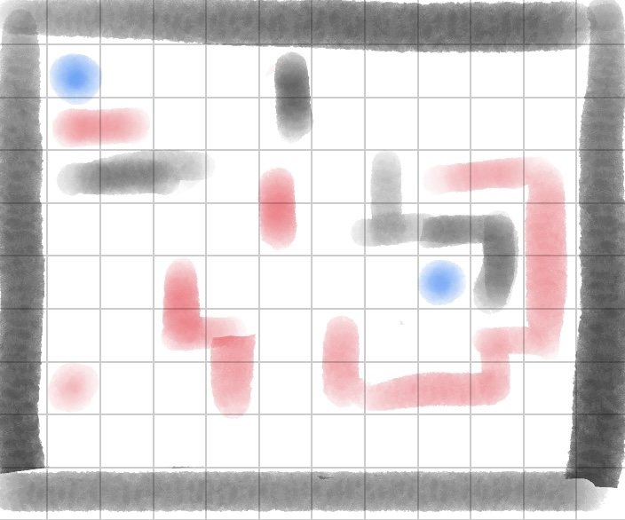

Perry, the platypus, is a spy working for the O.W.C.A. He received a mission to infiltrate Dr. Heinz Doofenshmirtz's secret base. After navigating countless traps, he finally managed to infiltrate the building. Now, Perry needs to report the base layout to the O.W.C.A. so they can enter the building safely. However, Perry only has an old pager that allows him to send text messages. How will he transmit the building layout information through a simple text message?

Here's an image providing a visual of one of the levels of Doofenshmirtz's secret base. Red indicates traps, black denotes walls, and blue denotes a staircase.



Perry, being a resourceful platypus, encoded the map into a text message format and sent it to the O.W.C.A:

```
{
	0: {
		'wall': [(0, 0), (0, 1), (0, 2), (0, 3), (0, 4), (0, 5),
				 (0, 6), (0, 7), (0, 8), (0, 9), (0,10), (0,11),
				 (1, 0), (1, 1), (1, 2), (1, 3), (1, 4), (1, 5),
				 (1, 0), (1,11), (2, 8), (1, 9), (1,10), (1,11),
				 (1, 2), (1, 7), (1, 8), (1, 9), (1,10), (1,11),
				 ... # other wall cells
				 ],
				 
		'trap': [(2, 1), (2, 2), (3, 5), (3, 8), (3, 9), (3, 10),
				... # other traps..
				],
				
		'stairs': [(1, 1), (5, 8)],
	}
}
```


When the O.W.C.A. receives the text message, they decode it to reconstruct the map. What Perry did is called serialization.

But what exactly is serialization?

Before delving into serialization, it's important to have a basic understanding of data structures and their storage in computers.

Let's consider an application that utilizes the linked list data structure. We aim to save this linked list at program termination into a file and load it at the start of the application to recreate the same data structure.

A node in a linked list contains data and the address of the next node stored in memory. We can't directly store the value and address as new node objects will have different addresses. Using old addresses would point to different locations.

To save and retrieve the data structure effectively, we need to serialize it.

Formal Definition of Serialization:
Serialization involves converting a data structure in memory into a stream of bytes, allowing it to be saved to a file or transmitted across a network. Serialization focuses on preserving the structure and relationships of data for storage or transmission.

There are numerous methods to serialize data, with popular approaches including JSON, XML, YAML, or Protobuf.
